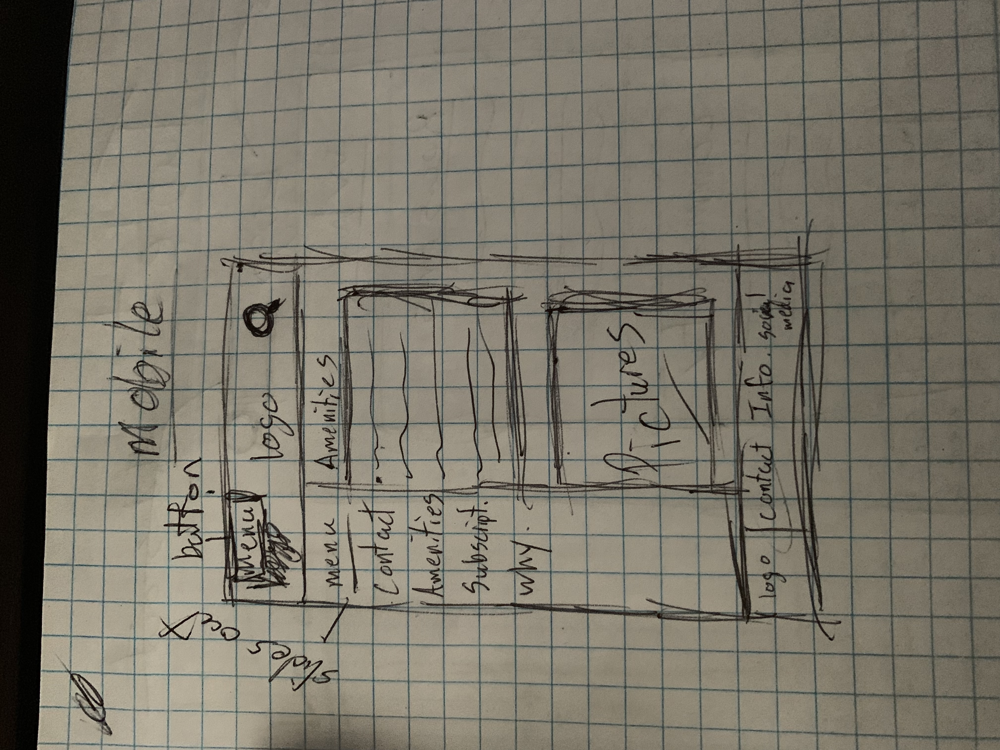
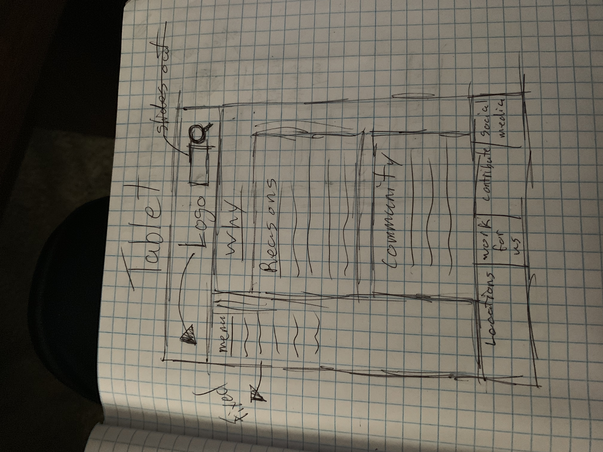
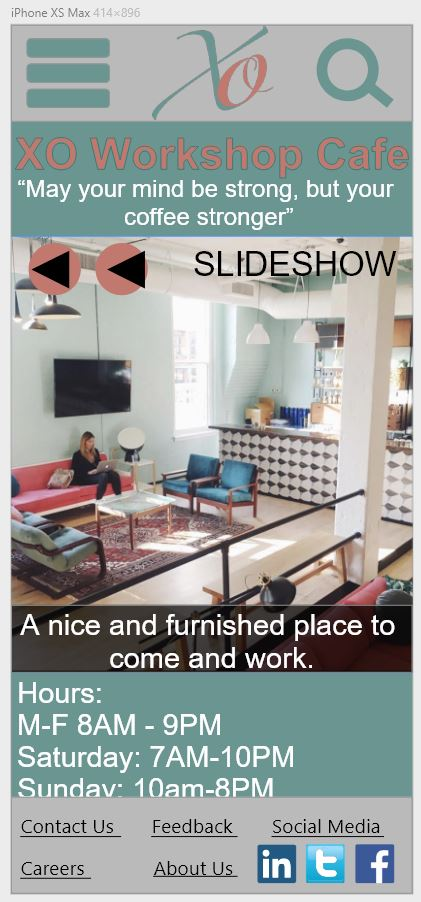
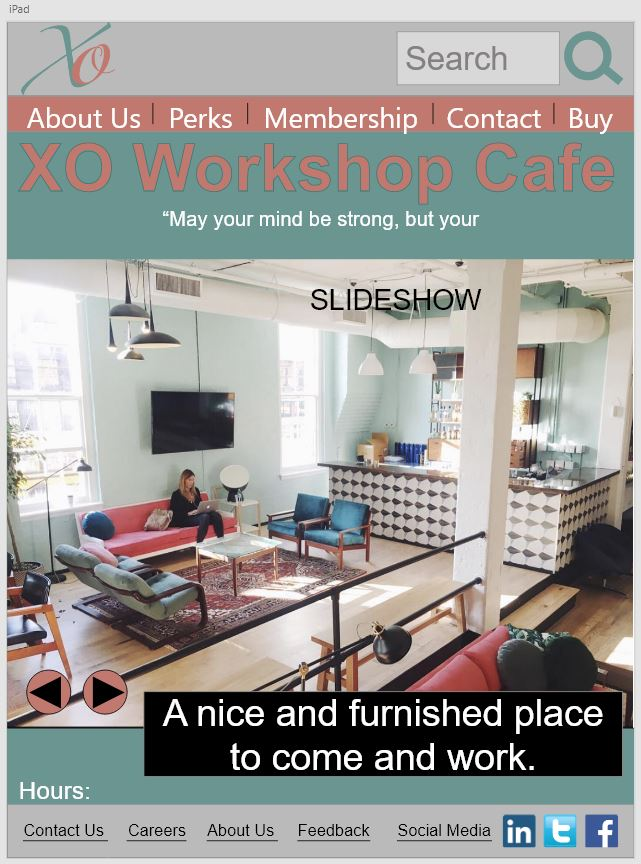
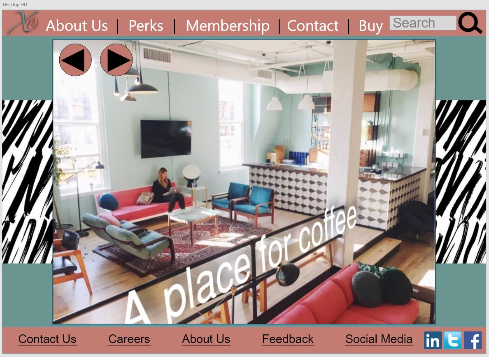

# _XO Workshop Cafe_

#### _{Brief description of application}, 2/25/2019_

#### By _**Ryan McLean**_

## Description

_A webpage for a company who wants their webpage to mirror their in-person presence. Attract people that would want to work in that environment. This webpage is meant to be luxurious and high-end but at the same time not be super intimidating to people who may wanna join. This company is meant for anyone and everyone who may want to work for them. The target user is ANYONE who may be interested in working for this company_

## Users Stories
### Andy
_Needs: A place to be able to work to spread his creativity to the world_

_Main Points: Cant find a place to work with fellow people in the industry who want to help him grow_

_How we can serve: We offer a safe place for anyone in many fields to come and work. Our community of people are ones who love to help each other_

## Screenshots
mobile sketch up for webpage

tablet sketch up for webpage

desktop sketch up for webpage

Mobile Wireframe

Tablet Wireframe

Desktop Wireframe

## Setup/Installation Requirements

* _No Setup/Installation Required_

## Known Bugs

_There are no known bugs._

## Support and contact details

_Please contact Ryan McLean at mcleanrs@comcast.net._

## Technologies Used

_Used Sketch for wireframing and prototyping._

### License

*This Software is Licensed under the MIT License.*

Copyright (c) 2019 **_Ryan McLean_**
