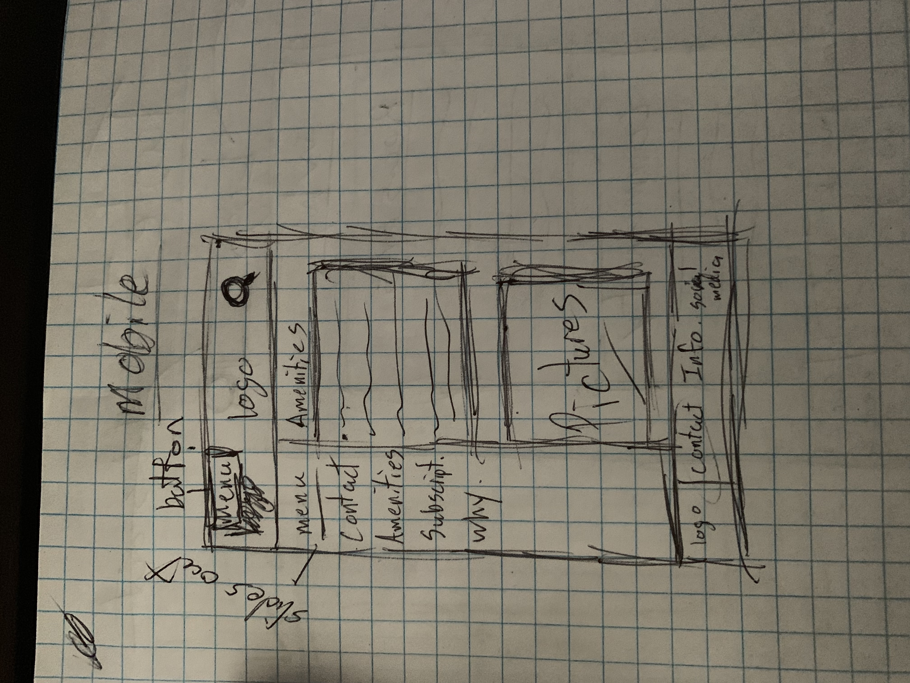
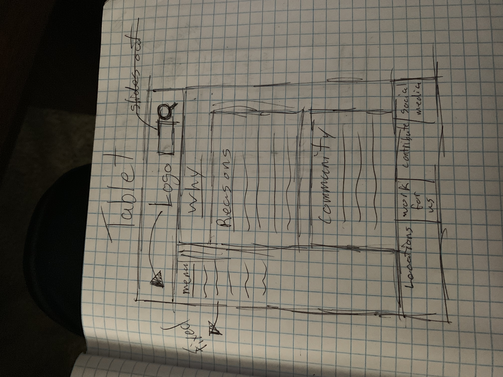
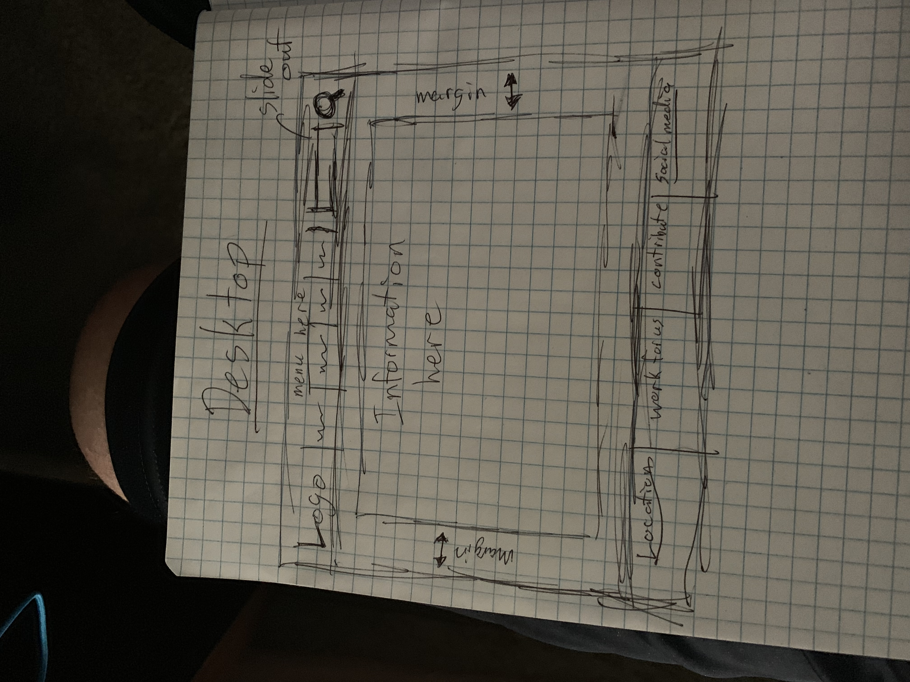
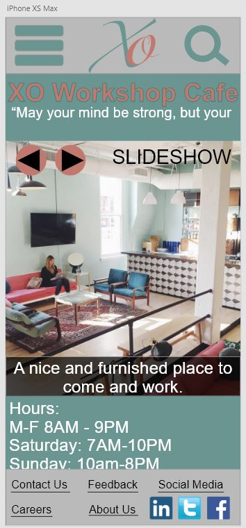
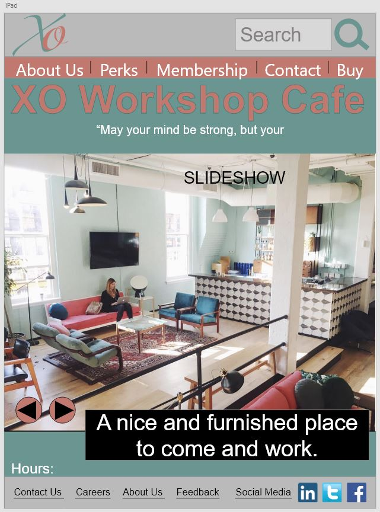
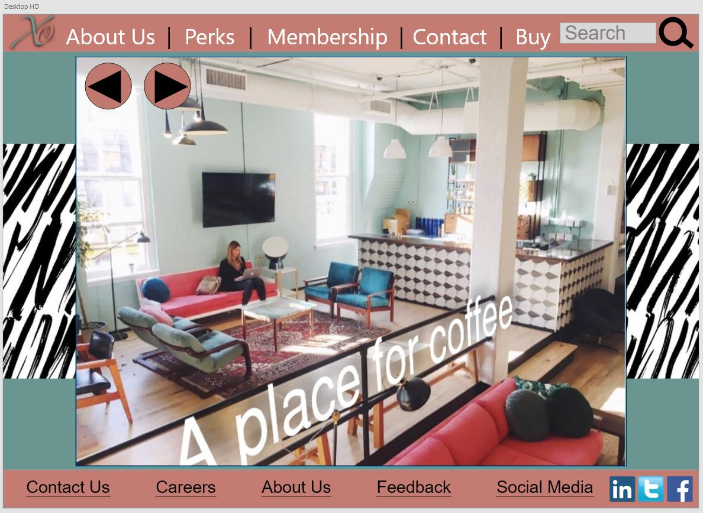

# _XO Workshop Cafe_

#### _XO is a new company who needs a website that is inviting yet high end, 2/25/2019_

#### By _**Ryan McLean**_

## Description

_A webpage for a company who wants their webpage to mirror their in-person presence. Attract people that would want to work in that environment. This webpage is meant to be luxurious and high-end but at the same time not be super intimidating to people who may wanna join. This company is meant for anyone and everyone who may want to work for them. The target user is ANYONE who may be interested in working for this company_

# Users Stories
## Andy
### "I need a website where I can get my order fast"
#### Needs
_A easy to navigate website when I'm at work_

_A website that doesn't make me think 'What button do I need to click next?'_

_Fast delivery of orders placed_

#### Pain points
_No variety of products offered_

_To many screens when trying to purchase my coffee_

_Mobile Friendly_

#### How we can serve
_Make website work on any platform and look clean_

_Make sure we have variety of coffee products in our store and online_

_Make the checkout process easy_

## Mary
### "Make me happy to be able to get in and out and order the products I want without wasting time"
#### Needs
_Ease to see new products_

_Customer Support when I have questions about products_

_Fast Shipping_

#### Pain points
_Have to search to see what's new_

_No help with products she has questions about_

_Slow Delivery_

#### How we can serve
_Our website shows what's new right on the homepage_

_Able to call our shop with phone number that's on the homepage if there is ever any questions_

_We guarantee 1-3day delivery so you can enjoy your coffee asap_

## Andy
### "Nothing is worse than employees who don't have the attitude to help"
#### Needs
_Simple website layout_

_Reviews from past customers_

_Helpful employees_

#### Pain points
_To much content on one page_

_No reviews from anywhere as if no one has ever shopped there before_

_Negative employees who seems like they don't care about their job_

#### How we can serve
_Our website is easy to navigate and you'll never feel overwhelmed about to much content on one page_

_We have reviews from people who have ordered online and reviews from customers who come in our store_

_Our employees always want to help in anyway they can_

# Brainstorm
* _Easy to navigate website is number 1 priority_
* _Easy to purchase products_
* _No page should have tons of information that it will feel overwhelming to the customer_

## Screenshots
mobile sketch up for webpage

tablet sketch up for webpage

desktop sketch up for webpage

Mobile Wireframe

Tablet Wireframe

Desktop Wireframe

## Setup/Installation Requirements

* _You can get these files by going into your terminal or powershell and using "git clone https://github.com/Lilkgb/UI" and it will copy the files to your computer._
* _Use any text editor of your choice to view the coding. I use Atom._
* _When ready make your own repository and push to your github repository._
* _Have Fun_

## Known Bugs

_If you are on desktop and go into mobile version and open the menu there then keep it open and resize the window to desktop version. It still shows the extra menu when it should be hidden._

## Support and contact details

_Please contact Ryan McLean at mcleanrs@comcast.net._

## Technologies Used

_Used Sketch for wireframing and prototyping. Used atom for coding. Languages used: HTML, Javascript, Sass, Css._

### License

*This Software is Licensed under the MIT License.*

Copyright (c) 2019 **_Ryan McLean_**
